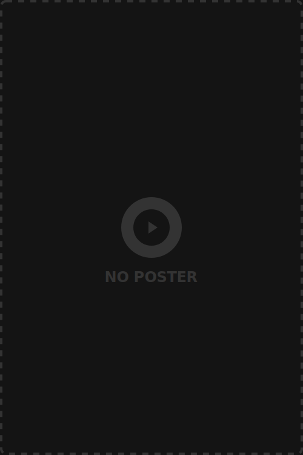

# HDMovieHub

The Ultimate Streaming Destination for Bollywood Blockbusters, Early Movie Releases, and premium streaming content.

 <!-- Replace with a real screenshot if available -->

## 🌟 Features

- **Hindi Cinema First:** Dynamically fetches and prioritizes Bollywood blockbusters, Hindi action, thriller, and romance movies, as well as South Indian hits on the homepage.
- **Cinematic Gold Aesthetic:** A highly polished, ultra-premium UI featuring a dark "Obsidian" background with luxurious "Cinematic Gold" accents, glassmorphism, and smooth micro-animations.
- **Curated Multi-Server Streaming:** Automatically aggregates the fastest and most reliable streaming servers, including early release sources (AutoEmbed) and multi-audio VIP sources (VidLink).
- **Responsive & Flawless Layout:** Meticulously designed `BentoGrid` movie cards, premium rank badges for top-trending content, and a sleek, unobtrusive floating mobile navbar.
- **Watchlist & Progress Tracking:** Seamlessly add movies and series to your personal watchlist to pick up right where you left off.

## 🚀 Tech Stack

- **Framework:** [Next.js 14+](https://nextjs.org/) (App Router)
- **Styling:** [Tailwind CSS v4](https://tailwindcss.com/)
- **Animations:** [Framer Motion](https://www.framer.com/motion/)
- **Icons:** [Lucide React](https://lucide.dev/)
- **Data Source:** [TMDB API](https://www.themoviedb.org/)

## 🛠️ Getting Started

First, ensure you have your TMDB API Key ready.

1. Clone the repository:
```bash
git clone https://github.com/stayrahul/hdmkviehub.git
cd hdmkviehub
```

2. Install dependencies:
```bash
npm install
```

3. Configure your environment variables:
Create a `.env.local` file in the root directory and add your TMDB API Key:
```env
NEXT_PUBLIC_TMDB_API_KEY=your_tmdb_api_key_here
```

4. Run the development server:
```bash
npm run dev
```

Open [http://localhost:3000](http://localhost:3000) with your browser to see the result.

## 🎨 Design Philosophy

HDMovieHub was engineered to depart from the standard, cluttered UI of traditional streaming sites. Instead of generic icons and crowded layouts, it uses a typography-based wordmark logo, heavily rounded "floating islands", and premium rank badges that never compromise the integrity of the layout grid. 

## 📜 License

This project is licensed under the MIT License.

---
*Developed by Rahul for Rabindra Kushwaha.*
